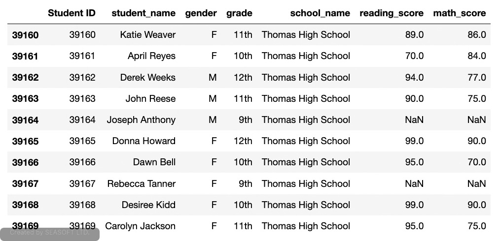
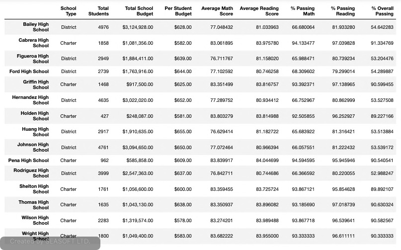
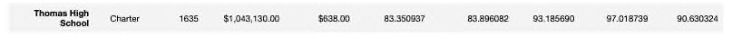

# Analysis of Standardized Test Scores for the PyCity School District
This project uses a Jupyter Notebook that contains code and results for this analysis. There are 2 notebooks of interest in the repository for this project.

PyCitySchools.ipynb contains the original data used to determine the performance of the schools in the PyCity School district.  Later it was suspected that the 9th grade scores at Thomas High School may have been tampered with which would have affected the original analysis. The code from this report has been refactored and is now superceded by the PyCityChallenge.ipynb file.

PyCityChallenge.ipynb is the latest report based on all scores except the 9th grade scores from Thomas High School.

The goal of this analysis is two-fold. For one, we want to find out if the grades from Thomas High School affected the overall performance for the school and for the summary of the entire district.  The other goal of this analysis is to use it instead of the report containing 9th grades scores from Thomas High School since they have been determined to be invalid for this particular school year.

## Overview of Analysis
This report contains the following information in 2 parts:

### Part 1:
- Cleans up the student names so they do not contain any prefixes or suffixes.

- Replaces the reading and math scores for the 9th graders at Thomas High School with NaN values and shows a summary of these results.

### Part 2:
Repeats the school district analysis and contains the following information:

- A high-level snapshot of the district's key metrics, presented in a table format
- An overview of the key metrics for each school, presented in a table format
- Tables presenting each of the following metrics:
   - Top 5 and bottom 5 performing schools, based on the overall passing rate
   - The average math score received by students in each grade level at each school
   - The average reading score received by students in each grade level at each school
   - School performance based on the budget per student
   - School performance based on the school size 
   - School performance based on the type of school

## Resources
The following CSV files were used as input to this analysis. If modifications were needed they are indicated here:

### schools_complete.csv 
This file contains a complete list of school will be in the following format:
- School ID: This is a unique integer identifying each school in the district.
- school_name: The name of the high school in text formatted printable string.
- type: String indicating whether the school is a "District" or "Charter" school.
- size: integer indicating the total number of students in the school.
- budget: long integer indicating the school's budget for the year the students were tested.

### students_complete.csv
This file contains a complete list of the student data for the entire district and is in the following format:
- Student ID: District-wide unique integer used to identify each student enrolled in the district.
- student_name: Name of the student.  Some names are not in the proper format and were re-formatted to ensure the names were valid.
- gender: gender of the student
- grade: A string representation of the grade level of the student.
- school_name: A string representing the name of the school the student is enrolled in.
- reading_score: integer representation of the student's reading score achieved on the standardized test results being analyzed.
- math_score: integer representation of the student's math score achieved on the standardized test results being analyzed.

## Input Data Cleanup
Before performing a new analysis of the data, the data contained in the students_complete.csv file needed to be cleaned up to fix any student names with suffixes or prefixes and to replace the math and reading scores for every student in Thomas High School with the value 'NaN' or 'not a number'.  This replacement will tell the prevent any rows that contain a value of 'NaN' from being used in any math calculations.

### Removal of Prefixes and Suffixes
These 2 images show a before and after snapshot of the names that were changed. In particular, note that "Dr. Richard Scott" was modified to simply "Richard Scott". Also, the first file is a snapshot of the excel version of the csv file. The second is the data in the notebook after cleaning.

#### Before cleaning:

#### After cleaning:

### Replacement of Reading and Math Scores
After the csv files were uploaded into this notebook, the student data was modified to replace the math and reading scores of all the 9th graders at Thomas High School (THS) w
ith NaN values. 

The following image shows a snapshot of the 9th graders their math and reading scores replaced while the rest of the students still have the original scores read in from the input file:

Note that only the scores for 9th graders have been replaced.

## Analysis Results
This section contains the results of the analysis of the PyCity School District for the latest standardized tests taken for every school in the district. All calculations included scores from every grade level in every school except for the 9th graders at THS.

### District Results
The following image shows a sample of the dataset used for the district. The table includes all the metrics for each school along with the metrics for each student in those schools all in one table. This table was used as the basis for all analysis going forward in this report.

The District Summary reported during the first analyis is shown in the image below. The results shown here include the 9th grade scores from THS:

This table shows the key metrics for the District Summary based on the sample dataset shown above in which the THS scores were ignored for all math calculations:

#### Key metrics covered in the district analysis
- Total Schools: The total number of schools included in the analyis. For this particular analysis, every high school in the PyCity School District has been included for a total of 15 schools.
- Total Students: The total number of students in all the high schools the district. This number includes the 9th graders from THS.
- Total Budget: The budget for all the high schools in the district.
- Average Math Score: This is the average Math score of all the students in the district excluding the 9th graders from THS. Before the scores were removed the average was 79.0% and after it was 78.9% This was a negligable decrease of 0.1% after removing the scores from THS.
- Average Reading Score: This is the average Reading score of all the students in the district excluding the 9th graders from THS. Here the scores are both 81.9%. There wasn't even a detectale difference in the average reading scores.
- % Passing Math: The % of all students that passed math with a score >= 70. This value excludes THS 9th graders. For math, including all scores, the percentage of students passing math was 75.0%.  After removing THS 9th grade scores, this value was 74.8 for a slight decrease of 0.2%.
- % Passing Reading: The % of all students that passed reading with a score >= 70. This value excludes THS 9th graders. Originally, this value was 85.8. After removing the scores, the value was 85.7 for a slight decrease of 0.1%.
- % Overall Passing: The % of all high school students that passed both reading and math excluding THS 9th graders. In the first analysis, this score was 65.2. For this recent analysis, the value wa 64.9 for a decrease of 0.3%.

Overall, there was not a significant difference to the district summary as demonstrated above when comparing before and after scores side by side. This most likely is due to THS having a lower number of students out of all the schools and that only their 9th grade scores were removed from the calculations.

### Overview of Key Metrics by School
Here we will delve into the differences between the individual schools when compared to THS. Observations based on several metrics such as school size, type and budget are described in this section.

The following table shows all the schools in the district and how they performed in relation to each other:

#### Key Metrics Covered in the school analysis
- School Type: This column indicates indicates if the school is a District School or Charter. There can be distinct differences between these types of schools and in this table we can see that overall passing is more than 30% greater in charter vs. disrict schools.  The exception here being THS which is due to the scores of the 9th graders being removed while still using the total number of students to obtain this value.
- Total Students: This is the total number of 9th, 10th, 11th, and 12th graders in each school that were included in the data used for this analysis. Later we will see how school sizes affect performance but off-hand we can quickly see how high schools with more than 2K students perform much lower overall.
- Total School Budget: This is the annual budget for each school in the district. A deeper analysis of this metric will be discussed later since it is difficult to determine much from the way the above table is sorted which is by school name instead of budget which will be easier to see when grouped in various bins based on the budget size.
- Per Student Budget: This is the average amount each school spends for each individual student in their high school.  This is a better indicator than total budget since some larger schools that spend more per student may perform worse than a small school with a larger budget per student. We will look at this metric in greater detail later as well.
- Average Math Score: This is the mean math score for all students in each school. A quick look shows that district schools average in the high end of the 70th percentile while charter schools are in the low end of the 80th percentile.
- Average Reading Score: This is the mean of all reading scores for each school.
- % Passing Math: This shows the percentage of the students in each school that passed the math portion of the standardized test. Any score >= 70 is considered passing.
- % Passing Reading: This shows the percentage of the students in each school that passed the reading portion of the standardized test. Any score >= 70 is considered passing.
- % Overall Passing: This shows the percentage of students in each school that passed both the reading and math portions of the test.

The next 2 images show the scores for THS as before the scores were removed and after. The table above and the THS scores in the images will be referenced in this section where were compare THS to the other schools and a few key metrics for all schools.

- Tables presenting each of the following metrics:
   - Top 5 and bottom 5 performing schools, based on the overall passing rate
   - The average math score received by students in each grade level at each school
   - The average reading score received by students in each grade level at each school
   - School performance based on the budget per student
   - School performance based on the school size 
   - School performance based on the type of school

