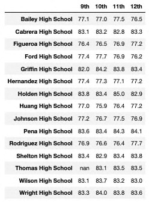
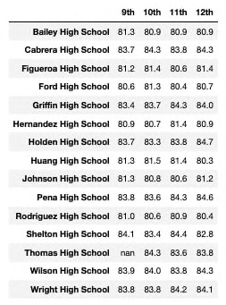
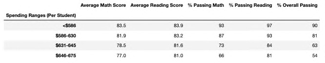
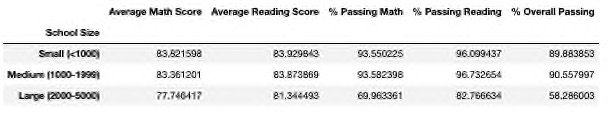
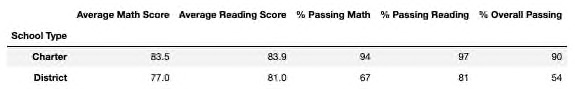

# Analysis of Standardized Test Scores for the PyCity School District

After completing the first analysis, the school board notified us that there the 9th grade scores from Thomas High School (THS) may have been tampered with and asked Maria to perfore a new analysis that did not include the scores of any of the THS 9th graders.

The goal of this second analysis is two-fold. For one, we want to find out if the grades from Thomas High School affected the overall performance for the school and for the summary of the entire district.  The other goal of this analysis is to use it instead of the report containing 9th grades scores from Thomas High School since they have been determined to be invalid for this particular school year.

## Overview of Analysis
This report contains the following information in 2 parts:

### Part 1:
- Reviews the input data and format.
- Reviews the clean up of the input data before performing the analysis.

- Replaces the reading and math scores for the 9th graders at Thomas High School with NaN values and shows a summary of these results.

### Part 2:
Repeats the school district analysis and compares the results to the new analysis to determine how each was affected by removing the 9th grade scores from THS. The following results will be addressed in this report:

- How was the district summary affected?
- How was the school summary affected?
- Thomas High School's performance relative to other schools
- Analysis of the following metrics:
   - Math and Reading Scores by Grade
   - Scores by School Spending
   - Scores by School Size
   - Scores by School Type

Following the analysist results in part 2 will be a final summary of the updated school district analysis after replacing the 9th grade scores by NaN values.

## Resources
The following CSV files were used as input to this analysis. If modifications were needed they are indicated here:

### schools_complete.csv 
This file contains a complete list of school will be in the following format:
- School ID: This is a unique integer identifying each school in the district.
- school_name: The name of the high school in text formatted printable string.
- type: String indicating whether the school is a "District" or "Charter" school.
- size: integer indicating the total number of students in the school.
- budget: long integer indicating the school's budget for the year the students were tested.

### students_complete.csv
This file contains a complete list of the student data for the entire district and is in the following format:
- Student ID: District-wide unique integer used to identify each student enrolled in the district.
- student_name: Name of the student.  Some names are not in the proper format and were re-formatted to ensure the names were valid.
- gender: gender of the student
- grade: A string representation of the grade level of the student.
- school_name: A string representing the name of the school the student is enrolled in.
- reading_score: integer representation of the student's reading score achieved on the standardized test results being analyzed.
- math_score: integer representation of the student's math score achieved on the standardized test results being analyzed.

## Input Data Cleanup
Before performing a new analysis of the data, the data contained in the students_complete.csv file needed to be cleaned up to fix any student names with suffixes or prefixes and to replace the math and reading scores for every student in Thomas High School with the value 'NaN' or 'not a number'.  This replacement will tell the prevent any rows that contain a value of 'NaN' from being used in any math calculations.

### Removal of Prefixes and Suffixes
These 2 images show a before and after snapshot of the names that were changed. In particular, note that "Dr. Richard Scott" was modified to simply "Richard Scott". Also, the first file is a snapshot of the excel version of the csv file. The second is the data in the notebook after cleaning.

#### Before cleaning:

#### After cleaning:

### Replacement of Reading and Math Scores
After the csv files were uploaded into this notebook, the student data was modified to replace the math and reading scores of all the 9th graders at Thomas High School (THS) w
ith NaN values. 

The following image shows a snapshot of the 9th graders their math and reading scores replaced while the rest of the students still have the original scores read in from the input file:

Note that only the scores for 9th graders have been replaced.

## Analysis Results
This section contains the results of the analysis of the PyCity School District for the latest standardized tests taken for every school in the district. All calculations included scores from every grade level in every school except for the 9th graders at THS.

### How was the District Summary affected?
The following image shows a sample of the dataset used for the district. The table includes all the metrics for each school along with the metrics for each student in those schools all in one table. This table was used as the basis for all analysis going forward in this report.

The District Summary reported during the first analyis is shown in the image below. The results shown here include the 9th grade scores from THS:

This table shows the key metrics for the District Summary based on the sample dataset shown above in which the THS scores were ignored for all math calculations:

#### Key metrics covered in the District Summary
- Total Schools: The total number of schools included in the analyis. For this particular analysis, every high school in the PyCity School District has been included for a total of 15 schools.
- Total Students: The total number of students in all the high schools the district. This number includes the 9th graders from THS.
- Total Budget: The budget for all the high schools in the district.
- Average Math Score: This is the average Math score of all the students in the district excluding the 9th graders from THS. Before the scores were removed the average was 79.0% and after it was 78.9% This was a negligable decrease of 0.1% after removing the scores from THS.
- Average Reading Score: This is the average Reading score of all the students in the district excluding the 9th graders from THS. Here the scores are both 81.9%. There wasn't even a detectale difference in the average reading scores.
- % Passing Math: The % of all students that passed math with a score >= 70. This value excludes THS 9th graders. For math, including all scores, the percentage of students passing math was 75.0%.  After removing THS 9th grade scores, this value was 74.8 for a slight decrease of 0.2%.
- % Passing Reading: The % of all students that passed reading with a score >= 70. This value excludes THS 9th graders. Originally, this value was 85.8. After removing the scores, the value was 85.7 for a slight decrease of 0.1%.
- % Overall Passing: The % of all high school students that passed both reading and math excluding THS 9th graders. In the first analysis, this score was 65.2. For this recent analysis, the value wa 64.9 for a decrease of 0.3%.

Overall, there was not a significant difference to the district summary as demonstrated above when comparing before and after scores side by side. This most likely is due to THS having a lower number of students out of all the schools and that only their 9th grade scores were removed from the calculations.

### How was the School Summary affected?
Here we will delve into the differences between the individual schools when compared to THS. Observations based on several metrics such as school size, type and budget are described in this section.

The following table shows all the schools in the district and how they performed in relation to each other:

#### Key Metrics Covered in the school analysis
- School Type: This column indicates indicates if the school is a District School or Charter. There can be distinct differences between these types of schools and in this table we can see that overall passing is more than 30% greater in charter vs. disrict schools.  The exception here being THS which is due to the scores of the 9th graders being removed while still using the total number of students to obtain this value.
- Total Students: This is the total number of 9th, 10th, 11th, and 12th graders in each school that were included in the data used for this analysis. Later we will see how school sizes affect performance but off-hand we can quickly see how high schools with more than 2K students perform much lower overall.
- Total School Budget: This is the annual budget for each school in the district. A deeper analysis of this metric will be discussed later since it is difficult to determine much from the way the above table is sorted which is by school name instead of budget which will be easier to see when grouped in various bins based on the budget size.
- Per Student Budget: This is the average amount each school spends for each individual student in their high school.  This is a better indicator than total budget since some larger schools that spend more per student may perform worse than a small school with a larger budget per student. We will look at this metric in greater detail later as well.
- Average Math Score: This is the mean math score for all students in each school. A quick look shows that district schools average in the high end of the 70th percentile while charter schools are in the low end of the 80th percentile.
- Average Reading Score: This is the mean of all reading scores for each school.
- % Passing Math: This shows the percentage of the students in each school that passed the math portion of the standardized test. Any score >= 70 is considered passing.
- % Passing Reading: This shows the percentage of the students in each school that passed the reading portion of the standardized test. Any score >= 70 is considered passing.
- % Overall Passing: This shows the percentage of students in each school that passed both the reading and math portions of the test.

### Thomas High School's performance relative to other schools
The next 2 images show the scores for THS as before the scores were removed and after. Note the following:
- Total number of students in both screen shots are identical. This was not changed so the calculations for budget and per student budget would still be correct in relation to the other schools. However, the calculations of scores for THS are based off the total number of 10th - 12th grade students since the values for 9th grade have been replaced with NaN and if they were included in the count the mean values would be much lower and inaccurate for the rest of the school which had no evidence of tampering.
- The average math score before removal was 83.4 and after was 83.4. no significant decrease here at all once rounded to 1 decimal.
- The average reading score before was 83.8 and after was 83.9. This is only a 0.1% decrease and as we will see later when comparing to other schools, it did not affect the overall standings for THS.
- The percentage of students passing math before was 93.3% and 93.2. Again, only a 0.1% decrease.
- The percentage of students passing reading before was 97.3% and 97.0%. This was a greater difference but still a relatively low decrease of 0.3%.
- The percentage of overall students passing both math and reading also had a decrease of 0.3% mostly likely affected by the decrease in reading scores that the 9th graders previously added to the data sample.

#### THS Scores Before

#### THS Scores After

As shown below, THS is the second highest performing school in the district. This result did not change even after the 9th grade scores were removed from the calculations.

#### Highest Peformers

#### Lowest Performers

### Additional Metrics Analyzed
The rest of the analysis was not affected at all by removing the 9th grade scores from the entire district.  This was the case even when taking out the number of decimal to 6 places, therefore, only one image of the output will be shown for each metric.

### Average Math Scores by Grade
The only differnce here is in the the scores for 9th graders at THS. From this graphic we can see that all math grades have been replaced by 'NaN'. In general, it seems as if the math scores for 11th graders was slightly higher in most schools but not a significant difference to be analyzed further.

### Average Reading Scores by Grade
Same as with the math scores, the only differnce here is in the the scores for 9th graders at THS. From this graphic we can see that all reading grades have also been replaced by 'NaN'. There does not look as if there is a significant differnce based on grade level for reading scores. In most cases, one or two grades did better by 0.1% but overall, no particular grade level stands out over any others.

### Scores by School Spending per Student

Budgets were divided into 4 ranges.  The largest scores were consistently in the lowest spending range per student. It is possible that schools that spend more need to do so because the students need more help and resources but we would need to delve into a deeper analysis than required for this report to see specifically what costs are involved that make these numbers different for each school.

&nbsp;

The schools that spend the most per student faired significantly lower in passing math and in overall percentage for passing both math and reading. We will keep this in mind when reviewing the other metrics.

### Scores by School Size 

School sizes were divided into 3 ranges: <1000, 1000-1999, 2000-5000.  Between the smallest and medium school ranges there was not a significatnt difference wth test scores.  The difference between medium and large schools was significant for the percentage of students passing math.  This affected the overall performance of the largest schools significantly as well.

This is another area where further analysis could benefit the performance of the district.

### Scores by School Type

School types are of type "Charter" or "District". Here, we can seet that Charter schools significantly outperform District schools in all score categories. The largest difference is in the seen in the math scores.

&nbsp;

Similar to how the math scores where significantly lower as school size increased, they are also lower in school types that are District.  If we go back to the School Summary table we saw earlier, we can quickly see that 6 out of 7 District Schools also fell into the bucket of largest schools where the performance was similar. The only large Charter School was Wilson High School had the lowest number of students out of all the schools in this range.

## Summary
There were 4 noticable changes in the updated school district analysis after the reading and math scores were replaced with values of 'NaN':

- Before the scores were replaced, the average math score was 79.0% and after it was 78.9% This was a negligable decrease of 0.1% after removing the scores from THS.
- The percentage of students passing math was originally 75.0%. After removing THS 9th grade scores, this value was 74.8 for a slight decrease of 0.2%.
- Originally, the percentage of students passing reading was 85.8%. After removing the scores, this value was 85.7 for a slight decrease of 0.1%.
- In the first analysis, the percentage of students passing both math and reading score was 65.2. For this recent analysis, the value wa 64.9 for a decrease of 0.3%.

Overall, replacing the grades for 9th graders did not affect the district summary in any significant manner to warrent futher investigation.

In the original analysis, there were some differences between types of schools, spending per school and school size that greatly affected math scores throughout the district that could use more analysis to help improve these scores. For the most part, district schools seem to need the most help and perhaps looking into other metrics that are different between these 2 types of schools could help make the largest improvment. Since school size is also a significant factor and most of the largest schools were district schools it may be a significant amount of change and spending that is needed in order to make up for these differences. It is recommended to compare the largest district schools with the largest charter school that managed to perform well regardless of its size.

#### Final TODO Checklist:
- Spell Check
- Review and Cleanup Notebook
- Clean up Git files and folders
- Resubmit for final time

