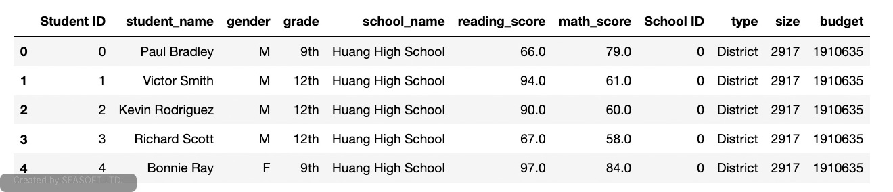
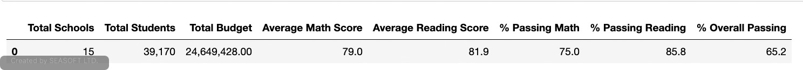

# Analysis of Standardized Test Scores for the PyCity School District
This project uses a Jupyter Notebook that contains code and results for this analysis. There are 2 notebooks of interest in the repository for this project.

PyCitySchools.ipynb contains the original data used to determine the performance of the schools in the PyCity School district.  Later it was suspected that the 9th grade scores at Thomas High School may have been tampered with which would have affected the original analysis. The code from this report has been refactored and is now superceded by the PyCityChallenge.inpynb file.

PyCityChallenge.ipynb is the latest report based on all scores except the 9th grade scores from Thomas High School.

The goal of this analysis is two-fold. For one, we want to find out if the grades from Thomas High School affected the overall performance for the school and for the summary of the entire district.  The other goal of this analysis is to use it instead of the report containing 9th grades scores from Thomas High School since they have been determined to be invalid for this partiulcar school year.

## Overview of Analysis
This report contains the following information in 2 parts:

### Part 1:
Replaces the reading an math scores for the 9th graders at Thomas High School and shows a summary of these results.

### Part 2:
Repeats the school district analysis and contains the following information:

- A high-level snapshot of the district's key metrics, presented in a table format
- An overview of the key metrics for each school, presented in a table format
- Tables presenting each of the following metrics:
   - Top 5 and bottom 5 performing schools, based on the overall passing rate
   - The average math score received by students in each grade level at each school
   - The average reading score received by students in each grade level at each school
   - School performance based on the budget per student
   - School performance based on the school size 
   - School performance based on the type of school

## Resources
The following CSV files were used as input to this analysis. If modifications were needed they are indicated here:
- schools_complete.csv: This file contains a complete list of school will be in the following format:
   - School ID: This is a unique integer identifying each school in the district.
   - school_name: The name of the high school in text formatted printable string.
   - type: String indictating whether the school is a "District" or "Charter" school.
   - size: integer indicting the total number of students in the school.
   - budget: long integer indicating the school's budget fot the year the students were tested.
- students_complete.csv: This file contains a complete list of the student data for the entire district and is in the following format:
   - Student ID: District-wide unique integer used to identify each student enrolled in the district.
   - student_name: Name of the student.  Some names are not in the proper format and were re-formatted to ensure the names were valid.
   - gender: gender of the student
   - grade: A string representation of the grade level of the student.
   - school_name: A string representing the name of the school the student is enrolled in.
   - reading_score: integer representation of the student's reading score achieved on the standardized test results being analyzed.
   - math_score: integer representation of the student's math score achieved on the standardized test results being analyzed.

## Input Data Cleanup
Before performing a new analysis of the data, the data contained in the students_complete.csv file needed to be cleaned up to fix any student names with suffixes or prefixes and to replace the math and reading scores for every student in Thomas High School with the value 'NaN' or 'not a number'.  This replacement will tell the notebook to ignore any rows that contain a value of 'NaN' when used in any math calculations.

### Removal of Prefixes and Suffixes
These 2 images show a before and after snapshot of the names that were changed. In particular, notice that "Dr. Richard Scott" was modified to simply "Richard Scott". Also, the first file is a snapshot of the excel version of the csv file. The second is the data in the notebook after cleaning.

The rest of this analysis will be referring to the data uploaded into the notebook for this project.

Before cleaning:

After cleaning:

### Replacement of Reading and Math Scores:
The following image shows a snapshot of the 9th graders after replacing their math and reading scores with 'Nan' values while the rest of the students still have the original scores read in from the input file:

Notice how only the scores for 9th graders have been replaced.

## School District Analysis
This section contains the analysis of the PyCity School District for all standardized test taken for every school in the district. All calculations will be performed for every grade level in every school except for the 9th graders at Thomas High School (THS).

### District Summary
The following image shows a sample of the dataset used for the district summary. The table includes all the metrics for each school along with each student in those schools all in the same table. This table was used as the basis for all analysis performed in this report.

The District Summary reported previously is shown in the image below. This image shows the analysis before taking the 9th grade scores from THS out of the dataset:

This table shows the key metrics for the District Summary based on the dataset shown above:

Key metrics shown are as follows:
- Total Schools: The total number of schools included in the analyis. For this particular analysis, every high school in the PyCity School District has been included for a total of 15 schools.
- Total Students: The total number of students in all the high schools the district. This number includes the 9th graders from THS.
- Total Budget: The budget for all the high schools in the district.
- Average Math Score: This is the average Math score of all the students in the district excluding the 9th graders from THS.
- Average Reading Score: This is the average Reading score of all the students in the district excluding the 9th graders from THS.
- % Passing Math: The % of all students that passed math with a score >= 70. This value excludes THS 9th graders.
- % Passing Reading: The % of all students that passed reading with a score >= 70. This value excludes THS 9th graders.
- % Overall Passing: The % of all high school students that passed both reading and math and excludes THS 9th graders.

TODO: provide a deeper analyis of the difference between including and excluding THS 9th graders and possibly include an image including 9th graders.

### Overview of Key Metrics by School
The following image shows all the schools in the district and how they performed in relation to each other. Note the following metrics:

- Tables presenting each of the following metrics:
   - Top 5 and bottom 5 performing schools, based on the overall passing rate
   - The average math score received by students in each grade level at each school
   - The average reading score received by students in each grade level at each school
   - School performance based on the budget per student
   - School performance based on the school size 
   - School performance based on the type of school

